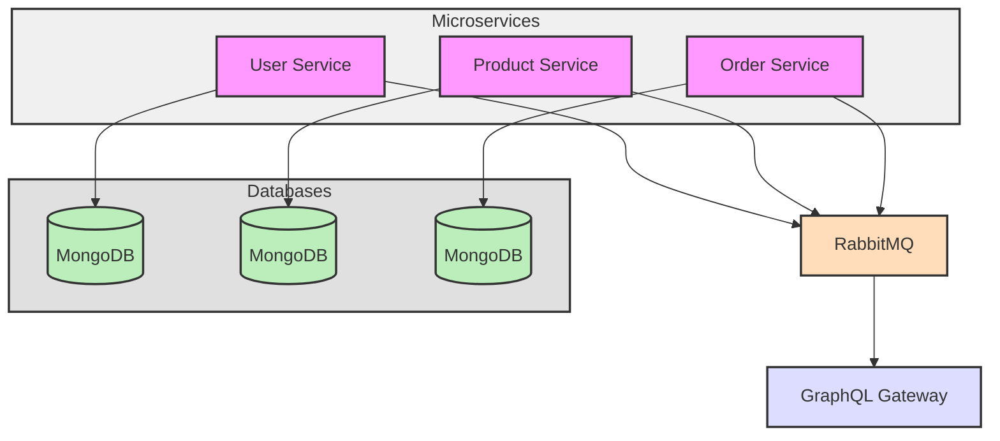

# Microservices Project with GraphQL Gateway

## Introduction
This project implements a microservices architecture for managing users, products, and orders, utilizing MongoDB Atlas for data storage and RabbitMQ for asynchronous communication. A unified GraphQL gateway serves as the entry point for client interactions, providing flexible queries and mutations.

## Architecture Diagram



## Key Components

1. **User Service**: Manages user data and authentication.
2. **Product Service**: Handles product information and inventory.
3. **Order Service**: Processes and manages customer orders.
4. **MongoDB Databases**: Each service has its own MongoDB database for data persistence.
5. **RabbitMQ**: Facilitates asynchronous communication between services.
6. **GraphQL Gateway**: Provides a unified API interface for clients to interact with the microservices.

## Tools and Technologies Used

- **Node.js**: Server-side runtime environment.
- **Express.js**: Web framework for building APIs.
- **MongoDB Atlas**: Cloud database service for storing data.
- **RabbitMQ**: Message broker for asynchronous communication.
- **GraphQL**: Query language for APIs.
- **Docker**: Containerization platform for easy deployment.

## Database Connection

Each microservice connects to its own MongoDB Atlas database using the connection string configured in environment variables.


## Getting Started
Follow the steps below to set up and run the project on your local machine or in a cloud environment.

### 1. Clone the Repository
```bash
git clone https://github.com/vamshigaddi/Backend_System_Using_MicroServices.git
cd microservices-backend
```
### 2. Install Required Packages
Each service in this project has its own dependencies. To install them, navigate to each service folder and run the following command:
```bash
1. npm init -y
2.npm install express mongoose amqplib  bcryptjs jsonwebtoken
```
 In GraphQL-gateway folder
```bash
1.npm install express express-graphql graphql-axios
```
### 3. Database Setup (MongoDB)
We are using MongoDB Atlas (a cloud database service) for managing the databases. You have two options for setting up the database:

- Option 1: Use MongoDB Atlas (Recommended)
- Create a free account on MongoDB Atlas.
- Set up a cluster and create a database for each service (User, Product, and Order).
  ```bash
   mongodb+srv://<Username>:<Password>@cluster0.o17cq.mongodb.net/<dbname>?retryWrites=true&w=majority
  ```
- Update the connection string in each service's environment configuration file (.env) with your own Username, Password, and Database Name.
- Option 2: Install MongoDB Locally
- If you prefer, you can install MongoDB locally on your machine. Download and install MongoDB from the official website.

### 4. Docker Setup
- To simplify running all the services, we’ve provided a Docker Compose setup.

- Download and install Docker from Docker's official site.
- In the project root directory, run the following command to build and start all services, including RabbitMQ and the GraphQL Gateway:
  ```bash
  docker-compose up --build
  ```
### 5. Access the GraphQL API Gateway
- Once the services are running, the GraphQL API Gateway will be available at:

- URL: http://localhost:4000
- Go to this URL and test the provided queries and mutations using the built-in GraphQL Playground.

### 6. Testing Service Endpoints
- You can also test individual service endpoints using Postman. The APIs for each service (User, Product, Order) are provided in the README file under each service section.

- Download Postman.
- Run each API endpoint to test the functionality (examples are provided in the API Endpoints section).

## API Documentation
#### API Endpoints

- **Register User**
  - **Endpoint**: `POST /api/users/register`
  - **Example**:
    ```json
    {
      "username": "testuser",
      "email": "test@example.com",
      "password": "password123"
    }
    ```

- **Login User**
  - **Endpoint**: `POST /api/users/login`
  - **Example**:
    ```json
    {
      "email": "test@example.com",
      "password": "password123"
    }
    ```

### 2. Product Service

Handles product creation, inventory management, and product details.

#### API Endpoints

- **Create Product**
  - **Endpoint**: `POST /api/products/create`
  - **Example**:
    ```json
    {
      "name": "Test Product",
      "description": "A sample product",
      "price": 19.99,
      "inventory": 100
    }
    ```

- **Update Inventory**
  - **Endpoint**: `PUT /api/products/update-inventory/:productId`
  - **Example**:
    ```json
    {
      "inventory": 150
    }
    ```

### 3. Order Service

Manages order creation and order details.

#### API Endpoints

- **Place Order**
  - **Endpoint**: `POST /api/orders`
  - **Example**:
    ```json
    {
      "products": [
        { "productId": "<Product_ID>", "quantity": 1 }
      ]
    }
    ```

## GraphQL Gateway

The GraphQL Gateway aggregates the services, allowing for flexible queries and mutations. It uses REST APIs to fetch data from the underlying services.

### Example Queries and Mutations
### User Service
- **Query Users**
  ```graphql
  query {
    users {
      id
      username
      email
    }
  }
- ***Retrive By Id***
  ```graphql
  query {
    user(id: "67027a5d7beb36795d5d5b68") {
      id
      username
    }
  }
- ***Create a New User (Mutation)***
   ```graphql
   mutation {
  createUser(username: "newUser", email: "newuser@example.com", password: "password153") {
    id
    username
    email
    }
  }
### Products Service
- ***Get All Products***
   ```graphql
  query {
  products {
    id
    name
    price
    description
  }
}
- ***Retrieve By Id***
   ```graphql
   query {
  product(id: "6702bb8530bda459ecd67dda") {
    id
    name
    description
    price
    inventory
  }
}
- ***Create New Product(mutation)***
   ```graphql
   mutation {
  createProduct(name: "New Product", description: "Description of the new product", price: 49.99, inventory: 100) {
    id
    name
    description
    price
    inventory
  }
}
### Order Service
- ***Get All Orders***
   ```graphql
   query {
  orders {
    id
    productId
    quantity
    status
    userId
  }
}
- ***Get orders by Id***
   ```graphql
   query {
  order(id: "6700cef1da8d2c1d4d3b6457") {
    id
    productId
    quantity
    status
    userId
  }
}
- ***Create a New Order (Mutation)***
   ```graphql
   mutation {
  createOrder(quantity: 5, productId: "6700ba741b42d5d1b111522b") {
    id
    productId
    quantity
    status
  }
}


## Contributing

We welcome contributions! Feel free to clone this repository and submit your improvements or enhancements. Your contributions help make this project better for everyone.

